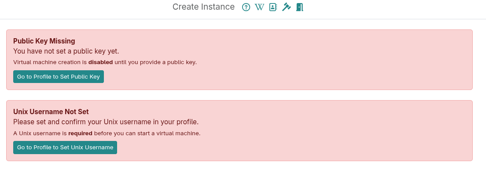
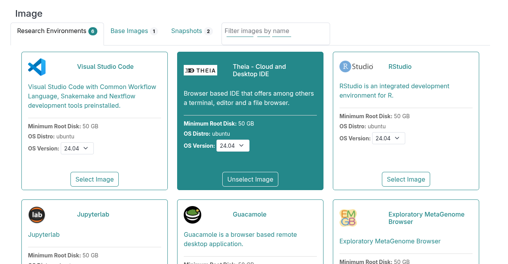
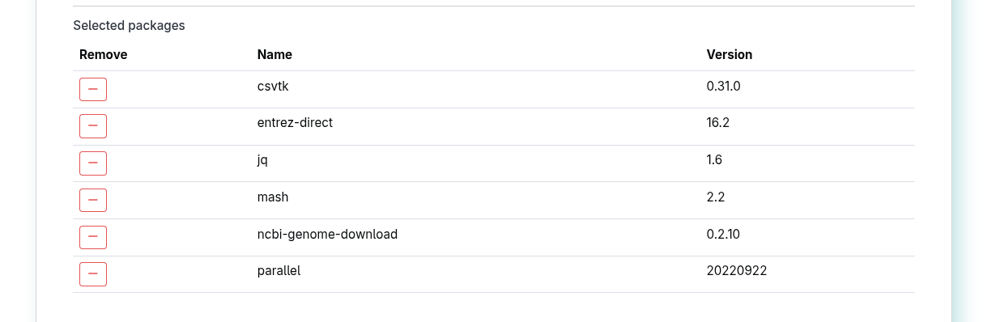
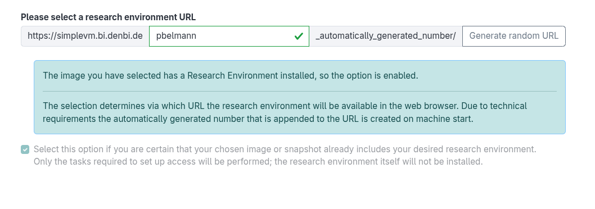
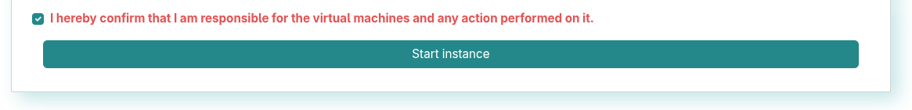

## Part 1: Big things start small

Since you are new to SimpleVM, it is resource-saving to start with a VM that
has a few cores and a small amount of RAM. The general idea is that you should first test the setup and
tools you want to use before scaling up your analysis.

### 1.1 Create a de.NBI Cloud Account and register for the SimpleVM project

If you do not have a de.NBI Cloud account, please register for one
via this link: https://cloud.denbi.de/register.
You can read more about the registration process in our 
de.NBI Cloud wiki: https://cloud.denbi.de/wiki/registration/.
Please make sure to to click on “continue” if this button shows up.

Once you obtain a de.NBI Cloud account, please register for the SimpleVM project: https://cloud.denbi.de/clum2025 .

The workshop organizers will approve your project membership application as soon as possible.
You should receive an email confirming that your are now member of the project.

### 1.2 Select the simplevmCLUM25 project

The actual tutorial starts from this page: https://simplevm.denbi.de . 

1. Click on the **Create new Instance** tab.

2. If you are already member of another SimpleVM project then you are offered a drop down menu to select
a project. In this case please select the **simplevmCLUM25** project. If this is
your first SimpleVM project, SimpleVM will let you know that have to go to the profile page again to generate a new key.

3. If you have no SSH key set so far or have not confirmed your unix name, just click on the **Got to Profile to set ...** button.
Regarding the SSH key click on the profile page on **Generate new keypair** and save the
private key. During this workshop you will not need this file because 
you will access all VMs via the browser. However, for your future work using
SimpleVM, we highly recommend to read our de.NBI Cloud wiki regarding
SSH keys: https://cloud.denbi.de/wiki/portal/user_information/#ssh-key
Regarding the Unix name, please confirm or update it before confirming.

   

### 1.3 Start a VM

1. When naming your VM, please use your name without any spaces (e.g. Max Mustermann -> MaxMusterman). 
2. Select **de.NBI default** as the flavor for your VM.
3. In the image section, please click on the *Research Environments* tab 
   and select the **TheiaIDE** image with OS version **24.04**.
   
4. Select the **Conda Packages** tab and choose the following tools with their version numbers given below for installation via Conda:
   The filter can be used to search for the packages:

   * ncbi-genome-download (0.3.3)
   * mash (2.3)
   * csvtk (0.31.0)
   * entrez-direct (16.2)
   * jq (1.6)
   * parallel (20220922)
   * minio-client (2025.08.13.08.35.41)
   
   
   You will learn in the next sections how to apply these tools.

4. Select a URL path for Theia. You will access Theia via this URL.
   
5. Grant access to the workshop organizers.
   This way the organizers get ssh access to your VM and can help you in case
   something does not work as expected.
   
6. Confirm the checkbox and click on **Start Instance**.
   

Next to [Section 2](part2.md)
