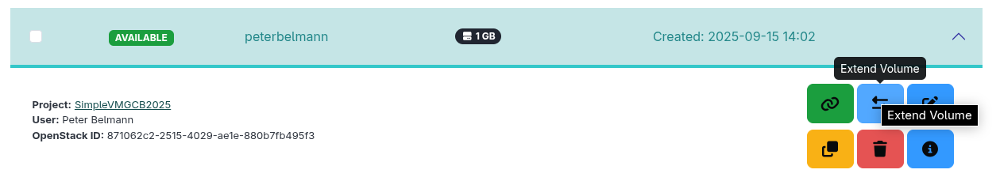

## Section 4: Analyze the detected Microbiome 

In the previous part you found a dataset that contains the **Staphylococcus Aureus** strain. 
We want now to try to assemble the metagenome and try to bin the strain in order to analyze the genes.

### 4.1 Prepare the Metagenomics-Toolkit run  

The Metagenomics-Toolkit will run the steps quality control, assembly, binnning and classification.
Especially for the classification part we need a lot of storage in order to store the database.

1. Extend the volume. Increase the volume size to 600 GB.
   

2. Adjust the filesystem following the instructions in our wiki.
   https://simplevm.denbi.de/wiki/simple_vm/volumes/#extend-a-volume

   ```
   sudo resize2fs /dev/device_name
   ```

3. Create database directory

   ```
   mkdir /vol/database
   ```

4. Download GTDB from our S3 storage using minio again. 

   ```
   mc cp --recursive sra/databases/gtdbtk_r226_v2_data/ /data/release226
   ```

5. Install Java 

   ```
   sudo apt install unzip default-jre 
   ```

6. Install Nextflow

   ```
   curl -s https://get.nextflow.io | bash
   ```

### 4.2 Run the Toolkit

   Create a file listing the SRA run ids you want to process: 
   ```
   echo -e "ACCESSION\nSRR492065" > sra.tsv 
   ```

   ```
   NXF_HOME=$PWD/.nextflow NXF_VER=25.04.2 nextflow run metagenomics/metagenomics-tk -r 0.13.2 -c ./aws.config \
        -ansi-log false -profile standard -resume -entry wFullPipeline -work-dir work -params-file /vol/metagenomics-tk/default/fullPipeline_illumina_nanpore.yml \
        --databases=/vol/databases/ \
        --input.SRA.S3.path=/vol/sra.tsv --output=output
   ``` 

### 4.3 Explain the results

   Inspect the GTDB-tk results
   You can open the GTDB-Tk output:
   ```
   ls output/SRR492065/1/magAttributes/4.0.0/gtdb/SRR492065_gtdbtk_generated_combined.tsv   
   ```

   In column two there is a Staphylococcus Aureus genome.

### 4.4 Clean up the VM

1. Go to the **Instances** page and open the dropdown menu and click on the volume management button.
    

    On the details page delete the VM.
    

2. Finally, since you saved your output data you can safely delete the VM.

Back to [Section 3](part3.md) | Next to [Section 5](part5.md)
